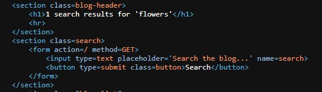

# Reflected XSS into HTML context with nothing encoded

## 📌 Lab Information
- Difficulty: Apprentice
- Vulnerability Type: Reflected Cross-site Scripting
- Lab URL
  
  ```
  https://portswigger.net/web-security/cross-site-scripting/reflected/lab-html-context-nothing-encoded
  ```
- Status: Solved
- Date: 21 FEB 2026

---

## 🎯 Objective
This lab contained a simple reflected cross-site scripting vulnerability in the search functionality and we have to find the vulnerability using entry points like Search bar.

---

## 🔎 Source → Sink Analysis

### Source:
We enter the tracker text on the search bar to track the text in source code.



### Sink:
We found the tracker text between the HTML tags.


---

## 💥 Exploit Payload
After finding the tracker text in source code and assured that the browser is reflinting the input, then we use the real payload to execute it on the browser.


---

## 🛠 Exploitation Steps
1. Identify input.
2. Locate sink in HTML.
3. Inject payload.
4. Execute alert box


